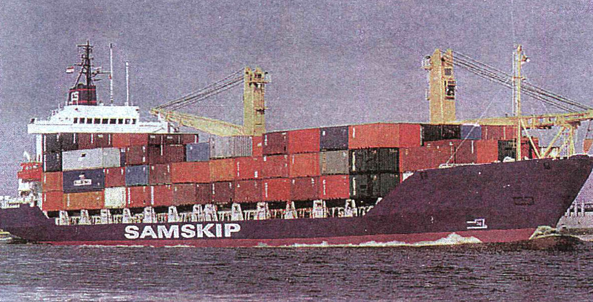

# Research on Icelandic Maritime Accidents from 1950 - 2018

**Author: Benedikt Óskarsson**  
*Final project in course Data Analysis (SC-T-498-GAGR) at Reykjavík University*  
  
*Special thanks to Hilmar Snorrason from Maritime Safety and Survival Training Centre in Iceland and 
the Icelandic Transportation Safety Board*

*Note that the data is not public at this point in time and because of that the code cannot 
be executed locally for recreation*  
  

## Project structure

The project is made with Jupyter Notebooks and Python. The paper can be found in notebook file 
**[Rannsókn á sjóslysum á Íslandi frá 1950.ipynb](https://github.com/bensi94/Icelandic-Maritime-Accidents-Resarch/blob/master/Ranns%C3%B3kn%20%C3%A1%20sj%C3%B3slysum%20%C3%A1%20%C3%8Dslandi%20fr%C3%A1%201950.ipynb)** It includes both executable code cells and text 
cells with descriptions along with generated graphics. The text cells are both in English and Icelandic but plots and 
data is unfortunately only available in Icelandic.  
  

### Chapters

* Introduction
* Data collection and wrangling
* Data inspection and analysing
  * How many sailors have perished in Iceland since 1950?
  * How do sailors perish?
  * Proportion between man and women
  * At what age have sailors perished?
  * How many ships have sunk?
  * How old are the ships when they sink?
  * Ship types
  * What type of materials are the ships made with?
  * From what part of the country do the ships come from?
  * Count of person loss in each accident
  * Connection between weather and accidents
  * How windy is it when accidents occur?
  * Temperature
  * Predict if ship will sink or loose man overboard
  * Predict ship materials
* Conclusion
